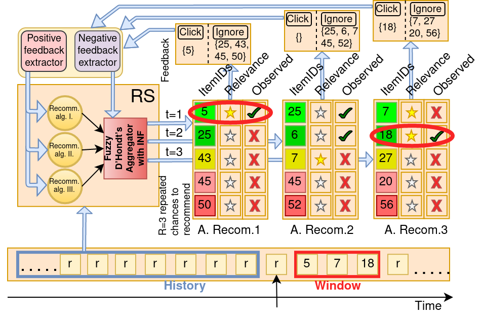

# HeterRecomPortfolio
This system's purpose is to serve as the framework for testing and evaluation of recommmender systems of various heterogenous architectures. It allows for testing fairness and proportionality of different types of basic recommenders aggregations. Sequential evaluation makes it possible to simulate online evaluation. 


### Code conventions:
Names of abstract classes begin with letter "A". For public class is usually created a separate file. Variables and functions are named in Camel case.


### Architecture description:
Class which represents portfolio structure definition is named [APortfolioDescription](src/portfolioDescription/aPortfolioDescription.py). 

[Simulator](src/simulator/simulator.py) allows a parallel simulation of several recommending [portfolios](src/portfolio/aPortfolio.py).
It gets on the input a list of child instances of the class [APortfolioDescription](src/portfolioDescription/aPortfolioDescription.py), list of instances
 of portfolio data models and a list of evaluation [operators](src/evaluationTool/aEvalTool.py). During seqential evaluation, evaluation operators iteratively
update portfolio data model representing votes assigned to base [recommenders](src/recommender/aRecommender.py).


### Sequential evaluation:

The main usecase of this system is sequential evaluation. The goal is to simulate online recommendation in an oflfine enviroment.



In the first step, the dataset of ratings is sorted by timestamp. Items are recommended for each user interaction. Relevant items correspond to observed items in the next (bounded) window.
System allows for experiments with repeated recommending. By using generated user behaviour, performed experiments were enhanced by using implicit negative feedback in portfolios.


### Inputs definition:

The input of the system is batches.


### HTTP Server:

The portfolio can be used by both the simulator (sequential evaluation) and the HTTP server (online recommending).


## Tutorial:

### Installation
- requires Python 3.7

```sh
$ pip install numpy pandas sklearn tensorflow implicit
```

### How to run it:

Before the first run of the system, it si necessary to generate input Batches (task descriptions), which represent simulations and copy them to the input directory.

#### Download GIT repository

```sh
$ git clone https://github.com/sbalcar/HeterRecomPortfolio.git
$ cd HeterRecomPortfolio
```
#### Download datasets

##### Download ML-1M dataset

```sh
$ cd datasets
$ wget http://files.grouplens.org/datasets/movielens/ml-1m.zip
$ unzip -a ml-1m.zip
```

##### Download Retailrocket dataset

```sh
$ cd datasets
$ mkdir retailrocket
$ cd retailrocket
```
Download files manually from the [website](https://www.kaggle.com/retailrocket/ecommerce-dataset).

```sh
$ ls
events.csv      item_properties_part1.csv      item_properties_part2.csv      category_tree.csv
```

##### Download Slantour dataset

```sh
$ cd datasets
$ mkdir slantour
$ cd slantour
```

Email authors to share this dataset with you.

```sh
$ ls
new_implicit_events.csv      new_serial_table.csv
```

#### Generate behaviours

The list of behaviors to be generated is located in the [src/execute/generateBehaviour.py](src/execute/generateBehaviour.py).

```sh
$ ./generateBehaviours.sh
```

#### Generate batches

The list of batches to be generated is located in the [src/execute/generateBatches.py](src/execute/generateBatches.py).

```sh
$ ./generateBatches.sh
```

#### Run input batches
The systems in each run takes one file (Batch instance) from the input directory, deletes it and runs it.

```sh
$ cp -r batches/* inputs/
$ ./run.sh
```


#### How to add new Recommender:
- create new child class of [ARecommender](src/recommender/aRecommender.py)
- we recommend adding recommender definition with default parameters to the class [InputRecomMLDefinition](src/input/inputRecomDefinition.py)

#### How to add new Agregator:
- create new child class of [AAgreggation](src/portfolio/aPortfolio.py)
- we recommend adding aggregator definition with default parameters to the class [InputAggrDefinition](src/input/inputAggrDefinition.py)

#### How to add new Portfolio Architecture:
- create new child class of [APortfolio](src/portfolio/aPortfolio.py)
- after that is necessary to create corresponding descriptive child class of [APortfolioDescription](src/portfolioDescription/aPortfolioDescription.py)
- it's necessary to extends child classes of [ASequentialSimulator](src/simulation/aSequentialSimulation.py) with capability to process this new portfolio architecture

#### How to add new input Batch definition:
- create new child class of [ABatch](src/input/aBatch.py)
- we recommend adding a call to this class' function generateBatches into file [generateBatches](src/execute/generateBatches.py)

#### How to add new dataset:
- adding the new dataset requires changing child class of [ARecommender](src/recommender/aRecommender.py), adding new [batches](src/input/aBatch.py) and update of [simulation](src/simulation/aSequentialSimulation.py)


